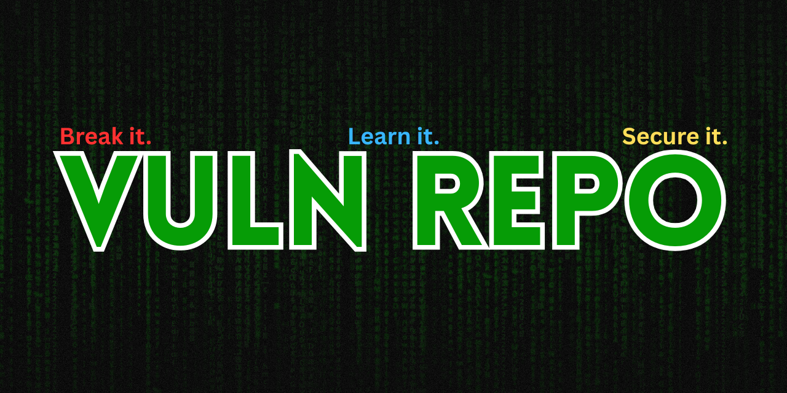

 

# 
VulnRepo

A collection of intentionally vulnerable environments, configurations, and tools for security training, penetration testing, and research.

> #### ⚠️ **Disclaimer:** All environments and configurations in this repository are **intentionally vulnerable**. They are designed **strictly for educational purposes**, ethical hacking practice, and tool testing in **isolated lab environments**. Real-world systems are often more complex and secured.
>
> ### Always use your skills responsibly and legally.

## ✅ Prerequisites

Before getting started, make sure you have the following set up on your system:

- 🐳 [Docker](https://www.docker.com/get-started) installed and properly configured
- Basic knowledge of Docker commands and networking
  > Need help setting up Docker? Check out the [official guide](https://docs.docker.com/get-docker/)

## 🧩 Contribute Your Own Vulnerable Images

Want to add your own vulnerable Docker environment to this repo? Contributions are welcome!

### 📦 How to Submit:

1. Fork this repository
2. Create a new folder with a meaningful name (e.g., `ssh-weak-password`)
3. Include:
   - A `Dockerfile`
   - A `README.md` explaining the vulnerability, how to build/run it, and its goal
4. Make a pull request with a short description of your contribution

> ✅ Please ensure the environment is safe, clearly marked as **intentionally vulnerable**, and not based on real targets.

Together, we can build a solid library for ethical hacking practice and learning!
